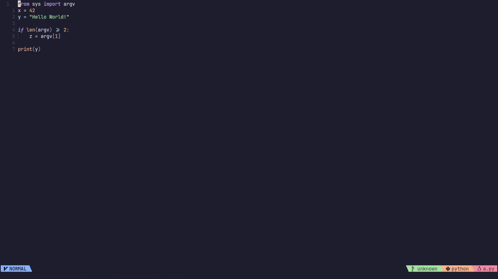

# compal.nvim
Set a keybinding to compile and run code in any programming language inside the neovim terminal or a seperate tmux pane.



## Installation
Using [Lazy](https://github.com/folke/lazy.nvim)
```lua
{ 'sashetophizika/compal.nvim' }
```
Using [packer](https://github.com/wbthomason/packer.nvim)
```lua
use 'sashetophizika/compal.nvim'

```
## Usage
The plugin provides several functions that execute commands based on the filetype defined by `vim.bo.filetype`. Modifications to filetype detection can be made with [`vim.filetype.add`](https://neovim.io/doc/user/lua.html#lua-filetype).

### Functions
* `run_shell`: Runs the command in the first shell pane in the window or if there are none, spawns a shell pane and runs there. 
* `run_interactive`: For languages that provide a repl, works like `run_shell` but it uses the corresponding repl instead of the shell. Overrides existing shell panes by default.
* `run_smart`: Defaults to `run_interactive`, with `run_shell` if filetype doesn't have a repl.
* `open_shell`: Opens a shell pane or focuses an existing one without running any commands.
* `open_repl`: Opens a repl pane for the current filetype or focuses an existing one without running any commands.


### Setup
Set keybindings inside `init.lua`
```lua
local compal = require("compal").setup()
vim.keymap.set("n", "<leader>rr", compal.run_smart)
vim.keymap.set("n", "<leader>rs", compal.run_shell)
vim.keymap.set("n", "<leader>ri", compal.run_interactive)
vim.keymap.set("n", "<leader>os", compal.open_shell)
vim.keymap.set("n", "<leader>or", compal.open_repl)
```

### Command
For programs that take arguments, there is the `Compal [smart | interactive | shell | set | get] *args` command. For convenience, you can create a keybinding that enters command mode and autofills part of the command.

```lua
vim.keymap.set("n", "<leader>ra", ":Compal smart ")
```

The `set` and `get` options let you check and change the configuration for the current session. For example, `:Compal set shell cmd cmake .` or `:Compal set shell cd` to remove the default cd command, where the filetype is inferred from `vim.bo.filetype`, but can also be given as the first argument.


## Configuration
### Language Configuration
The configuration for each language is a table of the form:

```lua
filetype = { 
        shell = {
            cd = optional_cd_before_cmd,
            cmd = command_for_shell,
        },
        interactive = {
            repl = command_to_launch_repl,
            cmd = command_to_load_file,
            title = tmux_pane_repl_title,
        },
}

```
The `interactive.title` field is for certain repls that have a title different from the command like `ghci` where the title is `ghc` and `ipython` where the title is `python`.

The `cmd` and `cd` options allow the use of the following wildcards:

* `%f`: filename with full path.
* `%s`: filename with path without extension.
* `%h`: path to parent directory of current file.
* `%g`: path to git root directory if it exists.

### Global Options
| Option           | Default           | Description
|------------------|-------------------|-------------|
| `tmux_split`     | `"tmux split -v"` | Command for creating the tmux pane
| `builtin_split`  | `"split"`         | Command for creating the neovim split window
| `save`           | `true`            | Write changes before running
| `focus_shell`    | `true`            | Focus the shell after `run_shell`  
| `focus_repl`     | `true`            | Focus the repl after `run_interactive`  
| `override_shell` | `true`            | Execute repl commands in an available shell pane
| `window`         | `false`           | Use tmux windows and neovim tabs instead of splits
| `prefer_tmux`    | `true`            | Use the neovim terminal even inside tmux if false

### Example configuration
```lua
local compal = require("compal").setup({
    rust = {
        shell = {
            cd = "cd %g",
            cmd = "cargo run --release",
        },
    },
    python = {
        interactive = {
            repl = "ipython",
            title = "python",
            cmd = "%run %f",
        },
    },
    tmux_split = "tmux split -v -p 40 -c #{pane_current_path}",
    focus_shell = false,
})
```

## Telescope Integration
If you have [telescope](https://github.com/nvim-telescope/telescope.nvim) installed, you can use it to spawn a dropdown menu with extra commands to choose from. First register the telescope extension:

```lua
require('telescope').load_extension('compal')
local compal_telescope = require('telescope').extensions.compal
```

Then enable telescope in your setup and create tables for extra commands: 

```lua
local compal = require('compal').setup({
    rust = {
        shell = {
            extra = {"cargo clippy", "cargo test", "rustc %f;%s"},
        },
    },
    python = {
        interactive = {
            extra = {"%run %f 42", "%run %f 3.14", "%run %f 01011001"},
        },
    },
    telescope = { 
        enabled = true,
        auto_append = true,
    }
})

vim.keymap.set('n', '<leader>ts', compal_telescope.shell)
vim.keymap.set('n', '<leader>ti', compal_telescope.interactive)

```

You can use `Compal add [shell|interactive] cmd` to add a new command to the list for the current session (e.g.`Compal add shell cargo run --release`). Using the `Compal` command to add arguments appends the new command to the list, unless `telescope.auto_append = false`. To set the selected command as default for the session, use `<C-s>` when selecting.

##  Default Language table
The default configuration for each programming laguage can be found in [config.lua](https://github.com/sashetophizika/compal.nvim/blob/master/lua/compal/config.lua).

Any missing language can be added when calling `setup()` using the given format. 
There is also an `interactive.in_shell [bool]` parameter for each language that defines if the repl should be nested inside a shell, by default only `true` for `ocaml` because `utop` doesn't work otherwise. If you are using an alternative repl (eg. `croissant` for `lua`) and the interactive function fails, try setting this option to true.

